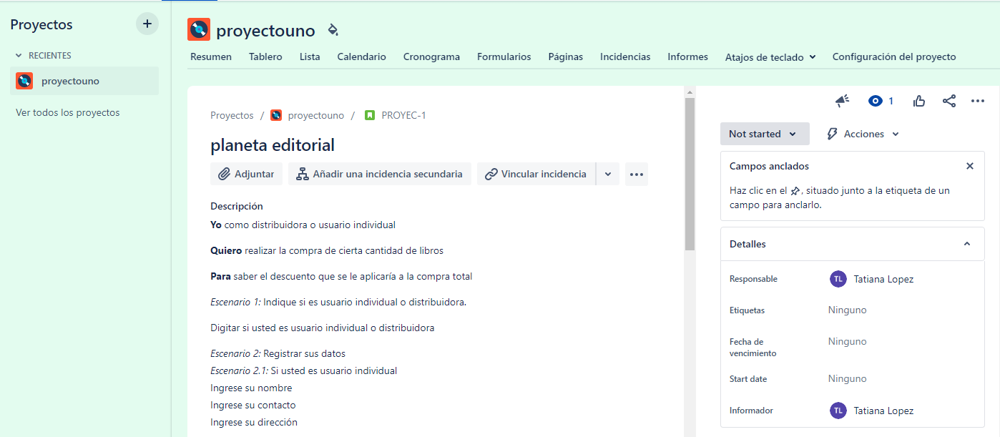
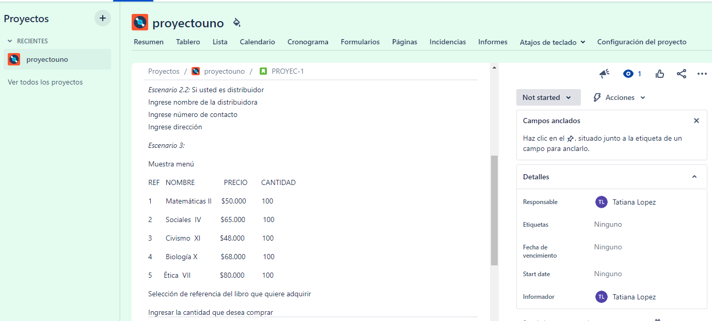
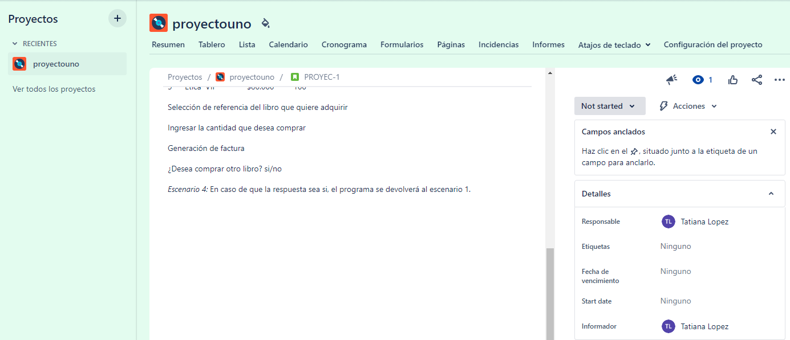
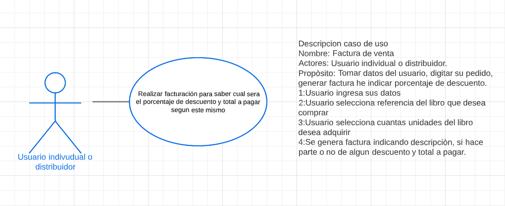
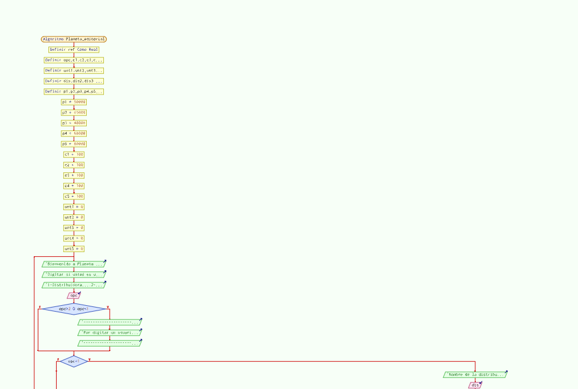
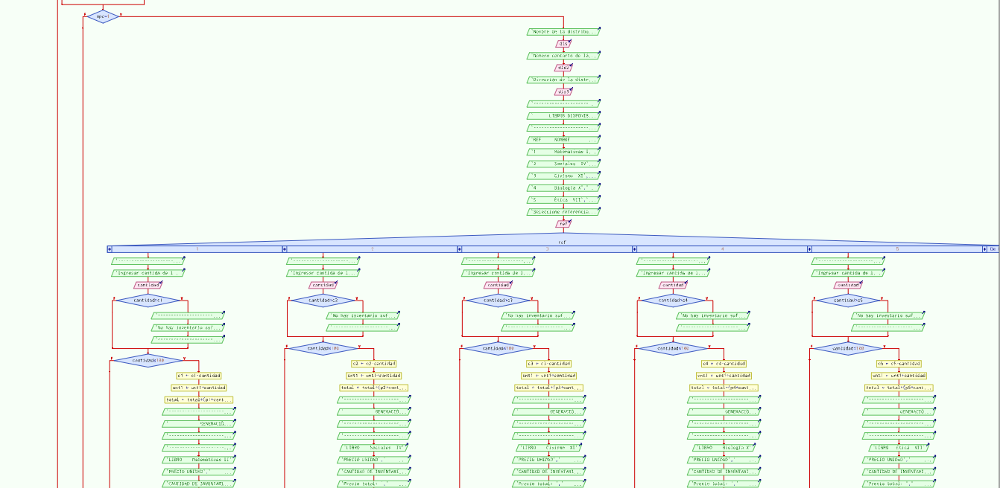
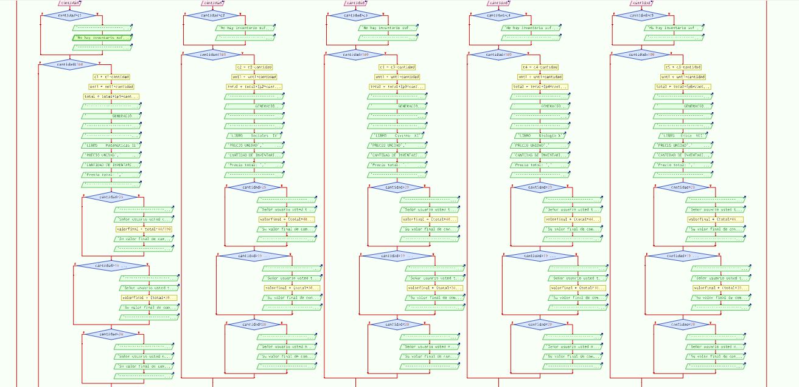
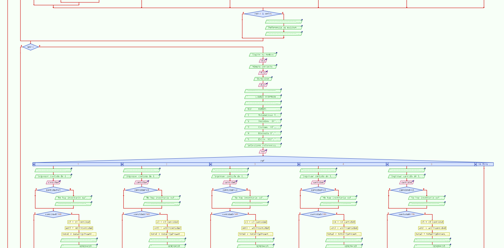
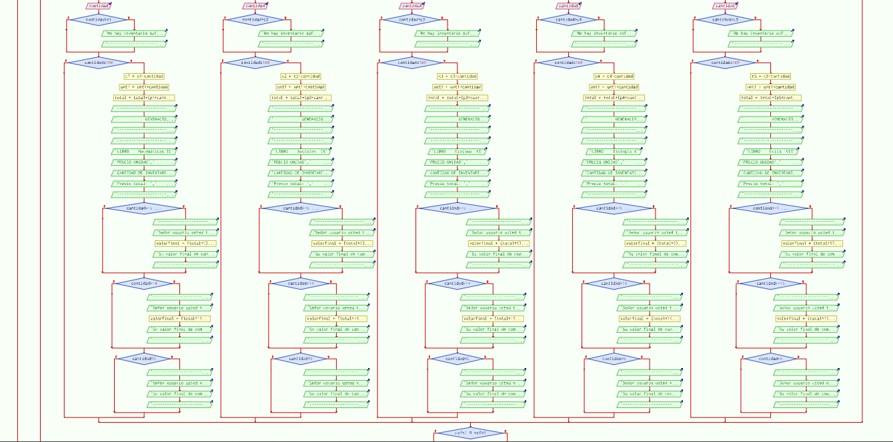
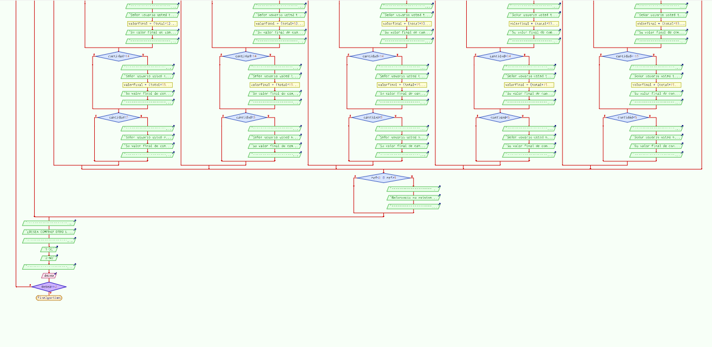

# # indice

  - [1. EJERCICIO BASE](#1-EJERCICIO-BASE)
  - [2. HISTORIA DE USUARIO](#2-HISTORIA-DE-USUARIO)
  - [3. CASO DE USO](#3-CASO-DE-USO)
  - [4. DIAGRAMA DE FLUJO](#4-DIAGRAMA-DE-FLUJO)
  - [5. Pseudocódigo](#5-Pseudocódigo)

 
 
 
 
 
 

# 1.EJERCICIO BASE

Una editorial necesita un programa para llevar una logistica de los libros que se van vendiendo a las diferentes distribuidoras o usuarios individuales teniendo en cuenta que siempre el inventario esta con 100 unidades de cada referencia arrojar factura con cantidad que quedaria en el inventario.
para la logistica de la facturaciòn se tendra que mostra que descuento tendra el cliente teniendo los siguientes parametros:

Si es mayorista (distribuidora) entonces:
*Si la compra es mayor a 20 libros tendra un 30% de descuento.
*Si la compra es mayor a 30 libros tendra un 40% de descuento.

De lo contrario no tendria ningun descuento en la compra que realice la distribuidora, si es usuario individual se aplicaria:

*Si la compra es mayor a 5 libros tendra un 5% de descuento.
*Si la compra es mayor a 15 libros tendra un 15% de descuento.

 
 
 
 

## 2.HISTORIA DE USUARIO

 
 
 
 

## 3.CASO DE USO

 
 
 
 

## 4.DIAGRAMA DE FLUJO

 
 
Definición de variables
 
Dar bienevenida y indicar si es usuario individual o distribuidora

 
 
Si usuario es distribuidoar, digitar datos de la distribuidora, se muestra menú de invenario de libros
 
se pregunta ¿Qué referencia de libro desea y cuantos libros desea comprar de esa referencia?
 
se genera factura

 
 

 
 
Si es usuario individual, digitar datos de usuario, se muestra menú de invenario de libros
 
se pregunta ¿Qué referencia de libro desea y cuantos libros desea comprar de esa referencia?
 
se genera factura

 
 

 
 

Se pregunta si desea comprar otro libro si indica que si se devolvera a dar la bienvenida el programa y si no se cerrara

 
 
 
 

## 5. SEUDOCÒDIGO

[Seudocodigo](Planeta_editoriapseint.psc)
